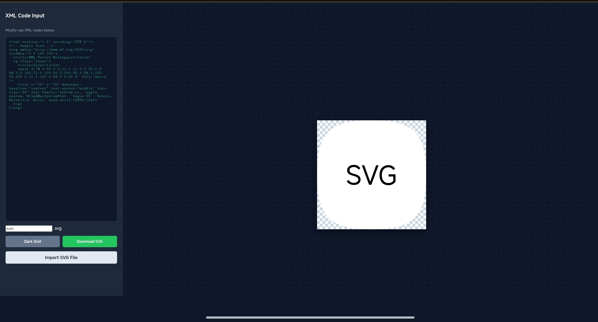

# Svg-Editor
This is the Svg Editor. [Visit site](http://xchanroldan101.github.io/Svg-Editor).
## What you can do 
* Edit XMl Code
* Upload SVG Files
* Change Grid Color to Light/Dark
* Download SVG Files
* See Image

Here is the preview of the image:

